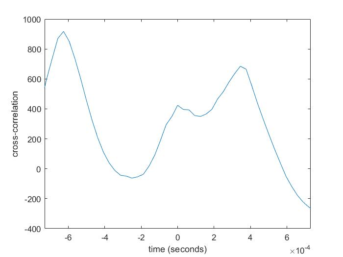

# Target-Speech-Extraction-in-matlab

## Target Speech Extraction from Noisy Acoustic Mixtures: A Three-Channel Signal Processing Approach

The setup for this project involves three spatially fixed directional sources and three microphones arranged linearly with a spacing of d = 25 cm, as shown in Fig. 1. The target signal is the speech of an English-speaking female, while the interferences are a German-speaking female and an English-speaking male. The sound propagation is assumed to follow plane wave behavior under anechoic conditions, with no reverberation or physical obstructions. These simplified conditions enable a focused exploration of signal processing techniques without the additional complexity introduced by real-world environments.

*Fig. 1. Acoustic mixture and microphone array setup*

The proposed solution employs three main stages. First, the DOAs of the sources are estimated using Time Differences of Arrival (TDOA), which provide critical spatial information for subsequent filtering. Second, an MVDR beamformer is designed to suppress directional interferences while preserving the target signal. Finally, post-filtering is applied using Ephraim’s MMSE Log-STSA method to reduce residual noise and further improve speech quality. The performance of the system is evaluated using metrics such as Signal-to-Interference Ratio (SIR) and Signal-to-Distortion Ratio (SDR).

## Results
### TDOA estimation

*Fig. 2. Cross-correlation of the signals from Mic#1 and Mic#3*

measured_tdoas =    1.0e-03 * [ -0.625000000000000,   0,   0.343750000000000]

measured_doas =   1.0e+02 * [ 1.490370312906723,   0.900000000000000,   0.618601694000804]

### Beampattern

*Fig. 3. beampattern*

### Post_filtering Metrics
Before speech enhancement method, the SDR is -6.2809, and the SIR is 4.2139

After applying Ephraim's MMSE Log-STSA method (1985), the SDR is -0.0405, while the SIR is 10.0180
